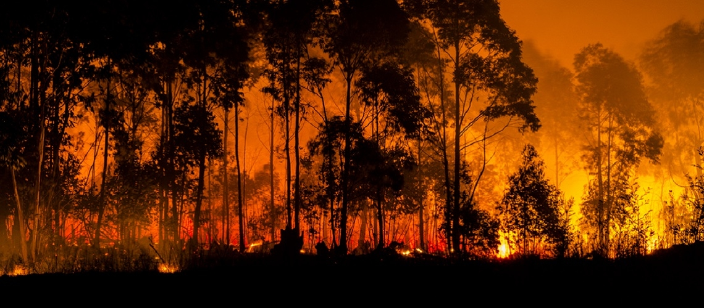
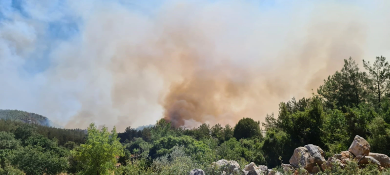

# H2O.ai Wildfire & Bushfire Challenge
### Wildfire Forecast for Turkey on a Monthly Basis
#### Team "Too Hot Encoder"
## Challenge Description
Wildfires (a.k.a. bushfires) are a serious problem that threaten lives, communities, wildlife, and forests every year, with global climate change, it is getting worse. They are a global issue and are considered one of the most dangerous disasters we face. While humans cause many fires, other factors, including wind, lightning, drought, and landscape, impact where fires occur and how they spread.

Wildfires present unique and severe forecasting challenges. Compared to storms, such as hurricanes, wildfires are ambiguous and hard to predict, especially when you start looking at large, intense wildfires. Those fires combine complex weather, different landscapes, fuel sources such as housing materials or dry forests, and more.

The H2O.ai Fights Fire Challenge aims to provide first responders, local leaders, businesses, and the public with new AI applications that can be used to help save lives and property. We expect the participants and teams to build for one of these audiences, but we want to make sure you have the creative freedom to decide which one to design for, as that will lead to a greater breadth of new applications being built.

### Motivation

The aim of the project is to predict the probability of wildfire occurrence in Turkey for each month in 2020. As a result of these predictions, it is aimed to carry out more intensive monitoring studies in possible fire areas and to respond to fires very soon after they start. It is also aimed to derive generalizable relations by interpreting the model outputs and the importance attributed to each variable used by the model.\n\nThe model trained with the data between 2013-2018, validated with the data from 2019. The results you will see are extracted from 2020, which is the test split for this project. The model didn't see any data from this split during the training.

[The wildfires at Turkey](https://en.wikipedia.org/wiki/2021_Turkey_wildfires) started in August 2021, spread over very large areas and resulted in the destruction of large areas and living things due to lack of intervention, have created a big agenda throughout the country. The public and politicians often complained about this technical inadequacy and suggested that improvements should be made in this regard. Within the scope of the project, it was desired to see whether an estimation could be made on this subject throughout the country, and if so, how successful the results would be

### The Goal
The goal of the project is to estimate the probability of a wildfire occurrence for each month of 2020 for each grid segment by dividing the area of Turkey in latitude and longitude with 1 degree precision.

### Methodology
LightGBM, an advanced decision tree algorithm, was used in the project. The machine learning model is trained using the past fire and temperature data and the synthesized data generated from these data.

- You can access the list of used data variables from [here](app/markdown/model_variables.md).
- You can access the details of wildfire dataset from [here](app/markdown/data_active_fire.md).
- You can access the details of temperature dataset from [here](app/markdown/data_temperatures.md).

## Working with the Project
With [this documentation](PROJECT.md), you can access information about the running and editing of the project.

## Author
* [Anil Ozturk](anilozturk96@gmail.com)